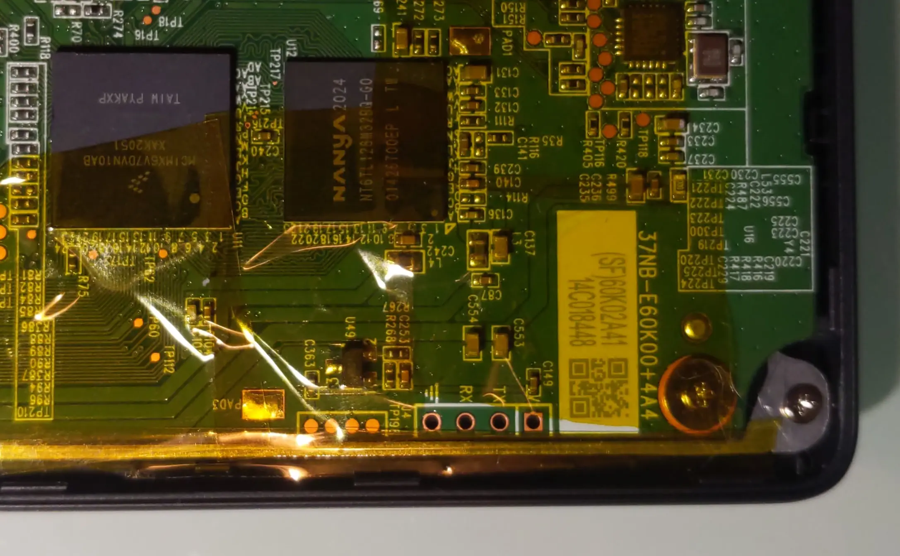

# Safety measures

If you're working with your Kobo e-reader and the back PCB is exposed, avoid killing your device by taking this safety measures.

## Discharging capacitors

Disconnect the battery using a non-conductive tool (e.g., a toothpick). After that, you can discharge the capacitors by pressing the power button for 10–20 seconds.

## Isolate the device

Remove the back cover and insulate the circuit with electrical tape, be sure to isolate all of the parts that you may touch while working on the PCB (leaving the four pins out).

Now your device should be safe enough to work on, remember to discharge the capacitors everytime you want to prevent shorting the circuit.
