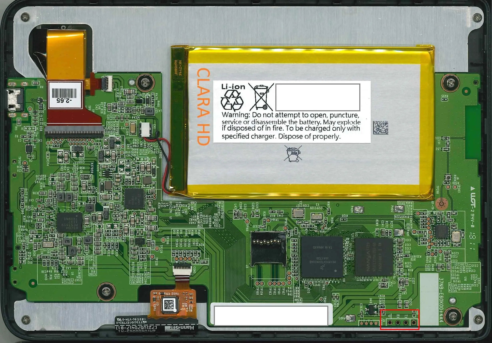
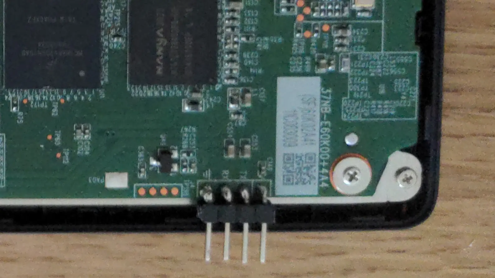

# Serial connection

Remove the back cover of the e-reader and follow the [safety measures](safety.md) if you haven't yet. Then locate the four serial pins, you can find the in the red box in the photo below.

<p align="center">
  
</p>

Now solder the pins as shown in the picture below.

<p align="center">
  
</p>

> Note: in case you don't want to solder the pins, just connect some jumper wires and hold them in place as you can (e.g., using plasticine).

To check the connection, connect the jumper wires to a serial-USB connector, connect the serial-USB to your computer, boot up the e-reader and check startup logs via your favourite serial communication software (e.g., minicom). The output should contain the following line.

    U-Boot 2016.03-00038-g4a92f9d (Jun 04 2018 - 14:20:13 +0800)

### Minicom configuration

Use the following minicom configuration:
```
    +-----------------------------------------------------------------------+
    | A -    Serial Device      : /dev/ttyUSB0                              |
    | B - Lockfile Location     : /var/run                                  |
    | C -   Callin Program      :                                           |
    | D -  Callout Program      :                                           |
    | E -    Bps/Par/Bits       : 115200 8N1                                |
    | F - Hardware Flow Control : No                                        |
    | G - Software Flow Control : No                                        |
    | H -     RS485 Enable      : No                                        |
    | I -   RS485 Rts On Send   : No                                        |
    | J -  RS485 Rts After Send : No                                        |
    | K -  RS485 Rx During Tx   : No                                        |
    | L -  RS485 Terminate Bus  : No                                        |
    | M - RS485 Delay Rts Before: 0                                         |
    | N - RS485 Delay Rts After : 0                                         |
    |                                                                       |
    |    Change which setting?                                              |
    +-----------------------------------------------------------------------+
```

## Testing the connection

Turn the device on and press any button to get to the U-Boot shell, now if you type `version` you should be able to obtain the version info.

    => version
    U-Boot 2020.10 (Dec 18 2022 - 19:24:55 +0100)

    arm-kobo-linux-gnueabihf-gcc (crosstool-NG 1.23.0.72-23ba174 - NiLuJe) 7.5.0
    GNU ld (crosstool-NG 1.23.0.72-23ba174 - NiLuJe) 2.34

If you're able to see the U-Boot startup logs but not your keypresses you may need to turn the local echo on by pressing Ctrl-A and then E.
